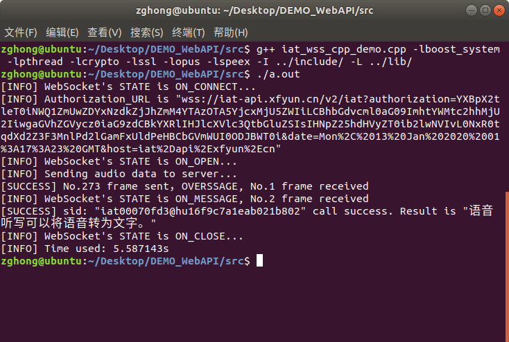
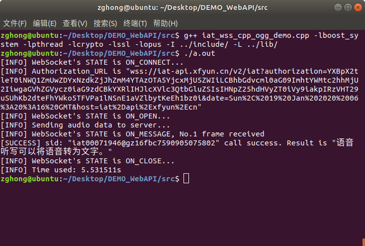
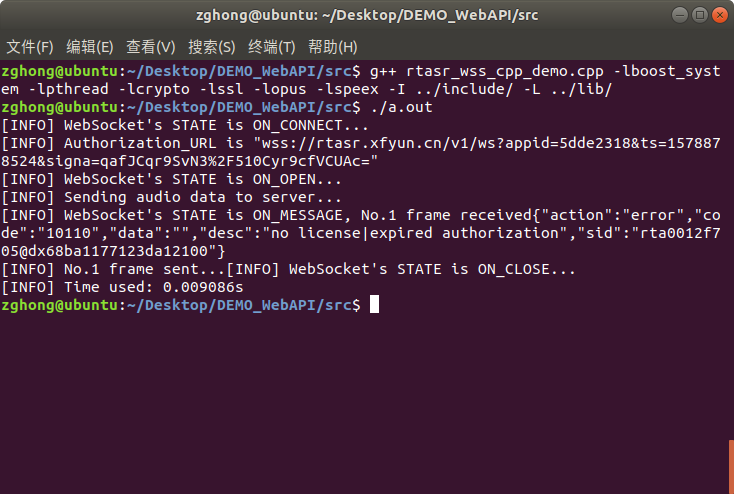
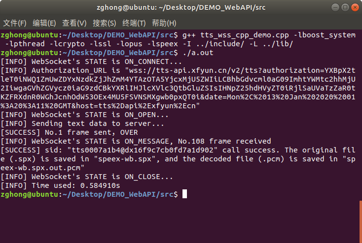
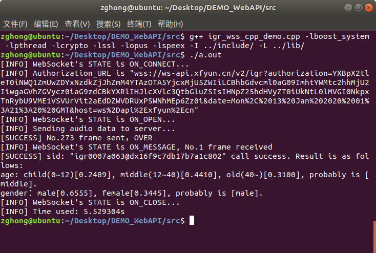

# DEMO_WebAPI

该项目是对[讯飞开放平台](https://www.xfyun.cn/doc/)下的相关产品 Websocket API 接口的 Demo 实现，项目基于 C/C++，涉及到 boost, openssl, libssl-dev, websocketpp, opus, speex 等官方及第三方开源库。

目前项目中所实现的 Websocket API 源代码位于`./src/`中，具体如下，：

```shell
├── iat_wss_cpp_demo.cpp # 语音听写
├── igr_wss_cpp_demo.cpp # 性别年龄识别
├── rtasr_wss_cpp_demo.cpp # 实时语音转写
└── tts_wss_cpp_demo.cpp # 语音合成
```

## 开发-运行环境

Demo 的编写及运行环境为：`Ubuntu 18.04.3 LTS`，安装的所有第三方库及版本如下：

- boost 1.69.0
- openssl 1.1.1
- libssl-dev 1.1.1
- websocketpp 0.8.1
- opus 1.3.1
- speex 1.2.0

> 其中，`websocketpp 0.8.1, opus 1.3.1, speex 1.2.0`等库相关文件已经集成在`./include, ./lib`中，剩余库请自行安装。
> 并非所有 demo 都涉及到所有库，具体请查看每个接口代码中所描述的库依赖。

## 讯飞引擎音频编码规范

已知联调通过的音频格式：

| 格式             | 字段名称 | 编码率     | 声道 | 位数 | 帧时长            | 帧头                                                             |
| ---------------- | -------- | ---------- | ---- | ---- | ----------------- | ---------------------------------------------------------------- |
| 原始 PCM         | raw      | 16000      | 1    | 16   |                   |                                                                  |
| Speex 窄带       | speex    | 8000       | 1    | 16   |                   | 每一帧前用**1 Byte**保存这一帧的数据长度。                       |
| Speex 宽带       | speex-wb | 16000      | 1    | 16   |                   | 每一帧前用**1 Byte**保存这一帧的数据长度。                       |
| Opus 窄带        | opus     | 8000       | 1    | 16   | 20ms 的数据为一帧 | 每一帧前用**2 Byte**保存这一帧的数据长度，保存的格式为**大端**。 |
| Opus 宽带        | opus-wb  | 16000      | 1    | 16   | 20ms 的数据为一帧 | 每一帧前用**2 Byte**保存这一帧的数据长度，保存的格式为**大端**。 |
| Opus 的 Ogg 封装 | opus-ogg | 8000/16000 | 1    | 16   | 20ms 的数据为一帧 |                                                                  |

> 在解 ogg 封装时，由于必须拿到整个 page 才能分解出其中的 packets，所以在流式编码时，要尽量减小每个 page 的大小，从而减少缓存整个 page 所带来的延迟。

## 编译-运行

所有 Demo 的源代码都位于`./src/`中，每一个接口对应一个文件。

- 每个 Demo 都继承于`iflytek_wssclient.hpp`和`iflytek_codec.hpp`两个文件中的类。

  - `iflytek_wssclient.hpp`，包含“讯飞开放平台”的 WebAPI 接口，发送 WebSocket(wss)请求的客户端类定义及实现。
  - `iflytek_codec.hpp`，包含“讯飞开放平台”的 WebAPI 接口，相关音频编解码类定义及实现。

- 运行前，请在对应 Demo 中填写相关参数，并按照 Demo 代码中的编译命令编译，运行。
- 如需更改相关个性化参数及具体细节，请修改对应 Demo 文件。

### 语音听写

将`.pcm`音频利用`opus`编码，编码数据上传服务器，返回语音识别结果。



### 语音听写（opus-ogg）

将`.pcm`音频利用`opus`编码，编码数据经过 ogg 封装，再上传服务器，返回语音识别结果。



### 实时语音转写

将`.pcm`音频数据上传到服务器，实时返回语音识别结果。




### 在线语音合成

将一段文本上传到服务器，返回该文本的语音合成结果`.spx`，并将该音频利用`speex`解码成`.pcm`。



### 性别年龄识别

将`.pcm`音频利用`speex`编码，编码数据上传服务器，返回该段音频说话人的性别和年龄概率。


